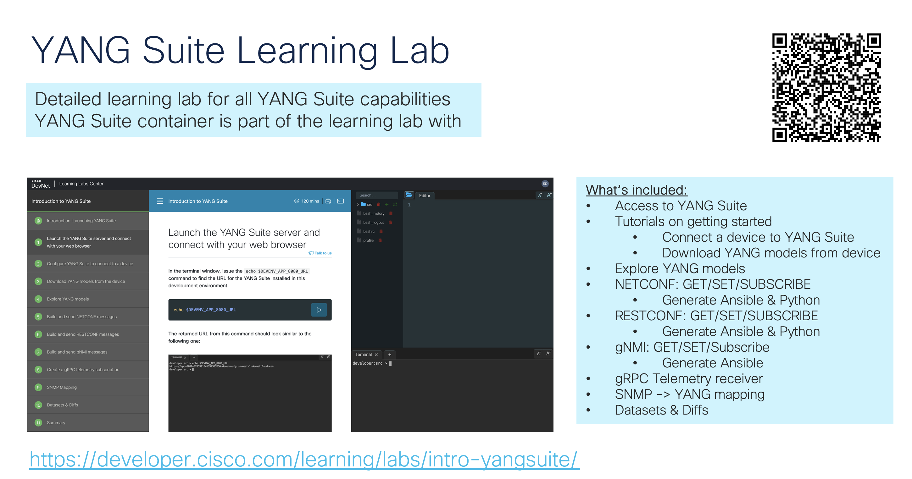

Copyright 2024 Cisco Systems, Inc

Cisco YANG Suite
==========

YANG Suite core Django application.

Capable of dynamic discovery of installed application plugins.
Provides common library APIs for logging, filesystem access,
GUI appearance and behavior, and client-server communication.

- Authors:  Members of the Cisco YANG Suite development team.
- Supports: Python 3.6, Python 3.7, and Python 3.8

YANG Suite can be installed as a Docker container or through Python
package management.  Docker-compose is the recommended install.

YANG Suite requires about 3.5GB of memory to load large Cisco native models.

## YANG Suite Resources

DevNet YANG Suite landing page: [developer.cisco.com/yangsuite](https://developer.cisco.com/yangsuite)

Documentation: [developer.cisco.com/docs/yangsuite](https://developer.cisco.com/docs/yangsuite)

Hands-on [Learning Lab](https://developer.cisco.com/learning/labs/intro-yangsuite/introduction-launching-yang-suite/)


[YANG Suite TDM PDF](https://pubhub.devnetcloud.com/media/yang-suite/docs/YANGSuite%20TDM%20-%20Communities.pdf)
----------------------------
This PDF document has technical details of all capabilites of the YANG Suite tool, including installation, setup, and use of all plugins and features. It is a very detailed document that can be refered to for using the tool and examples for each plugin.


# YANG Suite Installation: Docker or PIP? You decide

| Feature         | Docker                          | PIP (Python version 3.8)         |
| -------------   | -------------                   | ------------- |
| Prerequisites   | Install docker & docker compose | Install Python & PIP|
| Security        | HTTPS                           | HTTP         |
| YS GUI Ports    | 80 forwarded to 8443            | 8480 directly (no exposed ports) |
| Telemetry Ports | 57344 - 57345                   | Any unused & unprivileged TCP port |

## Prerequisites for Docker

To use the resources in this repository, you must install Docker on the system where you want to run YANG Suite. In addition, since this YANG Suite repository uses Docker Compose, your system needs Docker Compose. Docker Desktop for Mac and Docker Desktop for Windows installations include Compose and you can install those using instructions at https://docs.docker.com/install. For Linux, follow [these specific instructions to install Docker Compose on Linux systems](https://docs.docker.com/compose/install/#install-compose-on-linux-systems).

## Quick Start with Docker:

> [!NOTE]
> For quick exploring, see the [one-container-alternative](/one-container-alternative/) directory where you can find an alternative way to install YANG Suite using a single container with no user input required.

1. Clone this repository

2. Run start_yang_suite.sh or, 

3. Run docker compose up if you have already ran the start_yang_suite.sh

4. Access the tool at http://localhost or https://localhost:8443

```
git clone https://github.com/CiscoDevNet/yangsuite
cd yangsuite/docker/ ; bash ./start_yang_suite.sh
    or
cd yangsuite/docker/ ; docker compose up
    or
cd yangsuite/docker/ ; docker-compose up
```

The output should look similar to the image below:


The start_yang_suite.sh will ask to set the username, password, e-mail address, and for the certificate details. The output will look similar to the below, be sure to enter certificate details in the red hilight area:


Once YANG Suite is ready for use the following will be seen:


Now you can access the YANG Suite at http://localhost


Docker-based YANG Suite Installation
------------------------------------

The yangsuite/docker/start_yang_suite.sh script performs the following:

- Prompts for username, password, and email which will be the superuser to yangsuite.
- Gives the choice of creating test SSL/TLS certificate and key.
- Creates an environment file needed for the yangsuite docker container install.
- Runs docker-compose up.

Self-signed Certificate for testing
-----------------------------------

The SSL/TLS certificates installed with the nginx container should be obtained or generated using a trusted
certificate authority.  As a convenience, the yangsuite/docker/start_yang_suite.sh script will
generate a self-signed certificate/key to get you going quickly.

**WARNING:** Official SSL/TLS certificate/key should be obtained and copied to yangsuite/docker/nginx directory rather than using the test SSL/TLS certificate/key generated by the start_yang_suite.sh script.

Customization
-------------

The yangsuite/docker/yangsuite/production.py file contains Django settings.  The possible settings are extensive and information can found at https://www.djangoproject.com/.

Adding/Updating plugins can be done through the Admin-->Manage plugins page or by copying
the plugin wheels into the yangsuite/docker/yangsuite/ directory, uncomment the appropriate
lines in the yangsuite/docker/yangsuite/dockerfile, and run:

    docker-compose up --build


Example yangsuite.ini for external access
-------------------------------------------------

- The "allowed_host" variable sets which IP is allowed in to access the YANG Suite tool. In this example the host 0.0.0.0 is set but really I think only the star ("*") is needed because for this example all and every host should be allowed into the tool to allow it's use.
 

```
[DEFAULT]
data_path = /home/yangsuite/ys-data
port = 8480
allowed_hosts = 0.0.0.0 *
secret_key = justalongbunchofnumbersandstuffwashereokbyejeremywashereonafridayyo
static_root = /home/yangsuite/.local/share/yangsuite/static
settings_module = yangsuite.settings.dev.develop
eula_agreement = accepted
dna_advantage = detect
```


Access YANG Suite Docker Install with web browser
-------------------------------------------------

- The nginx container redirects port 80 to port 8443 which is used to interface with the yangsuite core.  Connect to http://localhost or https://localhost:8443. **NOTE:** A complaint about the certificate will appear if it was generated using "start_yang_suite.sh".
- The yangsuite-restconf plugin uses port 443 to communicate to your Cisco device so enable RESTCONF in the YANG Suite Device profile page for devices that support that protocol.
- If port 8443 is not available for use on the server, change the port number in the docker-compose.yml file and the nginx.conf file.
- If port 443 is not available for use on the server, change the port number in the docker-compose.yml file, configure the new RESTCONF port on the Cisco device, and configure the correct RESTCONF port in the YANG Suite Device profile.
- Login using username set during install.

Quick Start with PIP Install on MacOS
------------------------------

We recommend installing Homebrew to manage the Python installation on your mac.

Create a new directory. In the examples below, we'll call this directory `yangsuitevenv`

```
mkdir yangsuitevenv
```

Refer to the [HomeBrew website](https://brew.sh) for details on how to install HomeBrew on your Mac, or, follow the command below to install HomeBrew:

```
/bin/bash -c "$(curl -fsSL https://raw.githubusercontent.com/Homebrew/install/HEAD/install.sh)"
```

Use brew to install pyenv

```
brew install pyenv
```

Once pyenv is installed, install Python version 3.8

```
pyenv install 3.8
```

Now that the correct and YANG Suite-supported version of Python 3.8 is installed, create and activate the virtual environment. Note: you may need to change "3.8.12" below with the version of Python 3.8 that you installed

```
~/.pyenv/versions/3.8.12/bin/python -m venv yangsuitevenv
source yangsuitevenv/bin/activate
```

Next, install the YANG Suite tool within the virutal evnrionment using pip:

```
pip install pip wheel setuptools --upgrade
pip install yangsuite
```

Now that YANG Suite is installed, it can be started up. The credentials and settings will be configured on the first run:

```
yangsuite
```

Once started the tool can be access on the default port http://localhost:8480

See a full example of installing pre-requisites and configuring YANG Suite below:


PIP install using Linux in Windows
----------------------------
**NOTE** For Linux to run YANG Suite, a virtual environment is required

Here is an example installation flow on a Windows machine using Ubuntu 20.04 on Windows Subsystem Linux (WSL)

Install Ubuntu 20.04
```
wsl --install Ubuntu-20.04

Installing, this may take a few minutes...
Please create a default UNIX user account. The username does not need to match your Windows username.
For more information visit: https://aka.ms/wslusers
Enter new UNIX username: user
New password:
Retype new password:
passwd: password updated successfully
Installation successful!
To run a command as administrator (user "root"), use "sudo <command>".
See "man sudo_root" for details.

Welcome to Ubuntu 20.04.3 LTS (GNU/Linux 5.15.79.1-microsoft-standard-WSL2 x86_64)

 * Documentation:  https://help.ubuntu.com
 * Management:     https://landscape.canonical.com
 * Support:        https://ubuntu.com/advantage

  System information as of Tue Jan 10 15:53:15 PST 2023

  System load:  0.22                Processes:             9
  Usage of /:   0.1% of 1006.85GB   Users logged in:       0
  Memory usage: 14%                 IPv4 address for eth0: 172.28.133.196
  Swap usage:   0%

1 update can be applied immediately.
To see these additional updates run: apt list --upgradable


The list of available updates is more than a week old.
To check for new updates run: sudo apt update


This message is shown once a day. To disable it please create the
/home/user/.hushlogin file.
```

Ensure DNS is set up properly
```
wsl -s Ubuntu-20.04
wsl
cat /etc/resolv.conf
```

Validate python3 already part of Ubuntu-20.04 image
```
sudo apt update
sudo apt upgrade
which python3
```

Install python3 packages
```
sudo apt install python3-pip python3-lxml python3-venv		
```

Install yangsuite prerequisites for Ubuntu 
```
sudo apt install git openssh-client iputils-ping sqlite3 snmp
```

Create a new directory and virtual environment
```
mkdir testing
cd testing
mkdir yangsuite
cd yangsuite
```

Set Up YANG Suite with setup_yangsuite.sh. Note: Skip docker install and move forward with pip installation method instead
```
sudo ./setup_yangsuite.sh
SKIP													
python3 -m venv .venv											
source .venv/bin/activate
pip install -U pip setuptools wheel
pip install yangsuite
```

Install yangsuite plugins
```
pip install yangsuite-restconf yangsuite-coverage yangsuite-gnmi yangsuite-grpc-telemetry		
pip freeze > requirements.txt
```

Run yangsuite. When doing this for the first time, setup script stored to yangsuite.ini for future runs, see detailed output below
```
yangsuite											

**********************************************************************
Entering interactive configuration mode
**********************************************************************
YANG Suite stores user specific data (YANG modules, device profiles, etc.)
Set new path or use: [] /home/user/testing/yangsuite
What port number should YANG Suite listen on? [8480]
**********************************************************************
YANG Suite can be accessed remotely over the network.
**********************************************************************
Allow remote access? [n] y
**********************************************************************
Define hosts/IPs that YANG Suite will accept connections as.
Examples:
        CSCO-W-PF392JHY.cisco.com
        127.0.0.1
        CSCO-W-PF392JHY
        127.0.1.1
If the IP is not routable and you are behind NAT, use the public NAT address.
**********************************************************************
Enter a hostname, FQDN, or address [127.0.0.1]
Entries so far: ['0.0.0.0']
Add another entry? [n]
**********************************************************************
Interactive configuration complete
**********************************************************************
Save this configuration to
/home/user/.config/yangsuite/yangsuite.ini
so YANG Suite can automatically use it next time you start YANG Suite? [y]
**********************************************************************
Updating YANG Suite preferences file (/home/user/.config/yangsuite/yangsuite.ini)
**********************************************************************
2023-01-10 16:32:42,140 - yangsuite.ysgnmi.gnmi: WARNING: Install yangsuite-testmanager for opfield verification
2023-01-10 16:32:42,211 - yangsuite.paths: INFO: Creating new 'filename' directory path /home/user/testing/yangsuite/logs/
Removing database for upgrade.
No changes detected in app 'yscoverage'
No changes detected in app 'yangsuite'
No changes detected in app 'ysdevices'
No changes detected in app 'ysgnmi'
No changes detected in app 'ysrestconf'
Migrations for 'ysyangtree':
  .venv/lib/python3.8/site-packages/ysyangtree/migrations/0001_initial.py
    - Create model YangSetJSON
    - Create model YangSetTree
No changes detected in app 'ysnetconf'
No changes detected in app 'ysfilemanager'
No changes detected in app 'ysgrpctelemetry'
Operations to perform:
  Apply all migrations: admin, auth, contenttypes, django_registration, sessions, ysyangtree
Running migrations:
  Applying contenttypes.0001_initial... OK
  Applying auth.0001_initial... OK
  Applying admin.0001_initial... OK
  Applying admin.0002_logentry_remove_auto_add... OK
  Applying admin.0003_logentry_add_action_flag_choices... OK
  Applying contenttypes.0002_remove_content_type_name... OK
  Applying auth.0002_alter_permission_name_max_length... OK
  Applying auth.0003_alter_user_email_max_length... OK
  Applying auth.0004_alter_user_username_opts... OK
  Applying auth.0005_alter_user_last_login_null... OK
  Applying auth.0006_require_contenttypes_0002... OK
  Applying auth.0007_alter_validators_add_error_messages... OK
  Applying auth.0008_alter_user_username_max_length... OK
  Applying auth.0009_alter_user_last_name_max_length... OK
  Applying auth.0010_alter_group_name_max_length... OK
  Applying auth.0011_update_proxy_permissions... OK
  Applying django_registration.0001_initial... OK
  Applying sessions.0001_initial... OK
  Applying ysyangtree.0001_initial... OK
**********************************************************************
Creating static storage directory /home/user/.local/share/yangsuite/static
**********************************************************************

884 static files copied to '/home/user/.local/share/yangsuite/static'.
**********************************************************************
Your input is required to define an admin user
**********************************************************************
Username (leave blank to use 'user'): admin							
Email address: yangsuite@gmail.com
Password:
Password (again):
The password is too similar to the username.
This password is too short. It must contain at least 8 characters.
This password is too common.
Bypass password validation and create user anyway? [y/N]: y
Superuser created successfully.
**********************************************************************
YANG Suite data is stored at /home/user/testing/yangsuite. Be sure to back up this directory!
**********************************************************************
Performing system checks...

System check identified no issues (0 silenced).
January 11, 2023 - 00:34:02
Django version 2.2.28, using settings 'yangsuite.settings.production'
Starting development server at http://0.0.0.0:8480/
Quit the server with CONTROL-C.
```

Re-configuring yangsuite Server
----------------------------

- Activate the virtual environment
- Type yangsuite -h

Create an automated test environment using PyATS
----------------------------
See the PyATS Docs: https://developer.cisco.com/docs/pyats-getting-started/


Pre Release Versions
----------------------------
Manually specify pre-release version when using pip like in the example below to access the pre release and bug fix versions of yang suite and plugins:

```
docker container exec -it <yangsuite container ID> bash
pip install --upgrade --pre yangsuite-devices
exit

pip
source <your yangsuite venv>/bin/activate
pip install --upgrade --pre yangsuite-devices
```

Update all Plugins to Latest Release
----------------------------
```
pip3 install --upgrade yangsuite yangsuite-devices yangsuite-filemanager yangsuite-yangtree yangsuite-coverage yangsuite-gnmi yangsuite-grpc-telemetry yangsuite-netconf yangsuite-restconf
```

