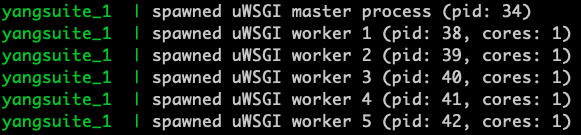

Copyright 2022 Cisco Systems, Inc

Cisco YANG Suite
==========

YANG Suite core Django application.

Capable of dynamic discovery of installed application plugins.
Provides common library APIs for logging, filesystem access,
GUI appearance and behavior, and client-server communication.

- Authors:  Members of the Cisco YANG Suite development team.
- Supports: Python 3.6, Python 3.7, Python 3.8

YANG Suite can be installed as a Docker container or through Python
package management.  Docker-compose is the recommended install.

Requires about 3.5GB of memory to load large Cisco native models.

## YANG Suite Resources

DevNet landing page: [developer.cisco.com/yangsuite](https://developer.cisco.com/yangsuite)

Documentation: [developer.cisco.com/docs/yangsuite](https://developer.cisco.com/docs/yangsuite)

## Prerequisites

To use the resources in this repository, you must install Docker on the system where you want to run YANG Suite. In addition, since this YANG Suite repository uses Docker Compose, your system needs Docker Compose. Docker Desktop for Mac and Docker Desktop for Windows installations include Compose and you can install those using instructions at https://docs.docker.com/install. For Linux, follow [these specific instructions to install Docker Compose on Linux systems](https://docs.docker.com/compose/install/#install-compose-on-linux-systems).

## Quick Start with Docker:

1. Clone this repository

2. Run start_yang_suite.sh or, 

3. Run docker compose up if you have already ran the start_yang_suite.sh

4. Access the tool at http://localhost or https://localhost:8443

```
git clone https://github.com/CiscoDevNet/yangsuite
cd yangsuite/docker/ ; bash ./start_yang_suite.sh
or
cd yangsuite/docker/ ; docker compose up
    or
cd yangsuite/docker/ ; docker-compose up
```

The output should look similar to below


The start_yang_suite.sh will ask to set the username, password, e-mail address, and for the certificate details. The output will look similar to the below, be sure to enter certificate details in the red hilight area


Once YANG Suite is ready for use the following will be seen



Now you can access the YANG Suite at http://localhost


Docker-based YANG Suite Installation
------------------------------------

The yangsuite/docker/start_yang_suite.sh script performs the following:

- Prompts for username, password, and email which will be the superuser to yangsuite.
- Gives the choice of creating test SSL/TLS certificate and key.
- Creates an environment file needed for the yangsuite docker container install.
- Runs docker-compose up.

Self-signed Certificate for testing
-----------------------------------

The SSL/TLS certificates installed with the nginx container should be obtained or generated using a trusted
certificate authority.  As a convenience the yangsuite/docker/start_yang_suite.sh script will
generate a self-signed certificate/key to get you going quickly.

**WARNING:** Official SSL/TLS certificate/key should be obtained and copied to yangsuite/docker/nginx directory rather than using the test SSL/TLS certificate/key generated by the start_yang_suite.sh script.

Customization
-------------

The yangsuite/docker/yangsuite/production.py file contains Django settings.  The possible settings are extensive and information can found at https://www.djangoproject.com/.

Adding/Updating plugins can be done through the Admin-->Manage plugins page or by copying
the plugin wheels into the yangsuite/docker/yangsuite/ directory, uncomment the appropriate
lines in the yangsuite/docker/yangsuite/dockerfile, and run:

    docker-compose up --build

Access YANG Suite Docker Install with web browser
-------------------------------------------------

- The nginx container redirects port 80 to port 8443 which is used to interface with the yangsuite core.  Connect to http://localhost or https://localhost:8443. **NOTE:** A complaint about the certificate will appear if it was generated using "start_yang_suite.sh".
- The yangsuite-restconf plugin uses port 443 to communicate to your Cisco device so enable restconf in the YANG Suite Device profile page for devices that support that protocol.
- If port 8443 is not available for use on the server, change the port number in the docker-compose.yml file and the nginx.conf file.
- If port 443 is not available for use on the server, change the port number in the docker-compose.yml file, configure the new restconf port on the Cisco device, and configure the correct restconf port in the YANG Suite Device profile.
- Login using username set during install.

Python Virtualenv Installation
------------------------------

WARNING: HTTPS support is not available unless a web server is installed like NGINX and frontended with uwsgi.
Instructions for that can be found searching online.

- Create a Python 3.6, 3.7, or 3.8 virtural environment and activate it.
- Type ``pip install yangsuite[core]``
- Use ``yangsuite`` to start the yangsuite server
- User is prompted to set superuser credentials.
- Use ctrl-c to stop the yangsuite server
- Connect to http://localhost:8480.
- Login using user set at install.
- Install other plugins using Admin-->Manage plugins page.

Configuring yangsuite Server
----------------------------

- Activate the virtual environment
- Type ``yangsuite -h``


Pre Release Versions
----------------------------
Manually specify pre-release version when using pip like in the example below to access the pre release and bug fix versions of yang suite and plugins:

```
docker container exec -it <yangsuite container ID> bash
pip install --upgrade --pre yangsuite-devices
exit

pip
source <your yangsuite venv>/bin/activate
pip install --upgrade --pre yangsuite-devices
```
