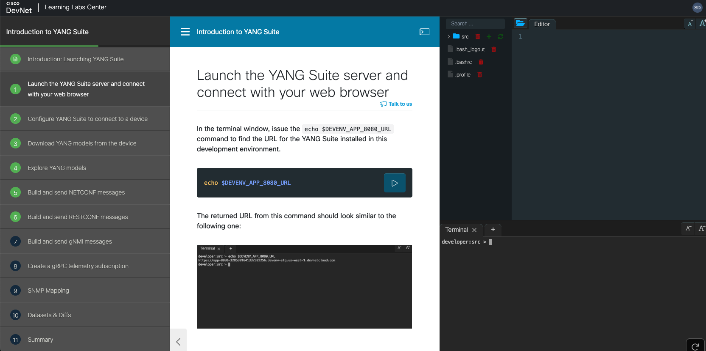
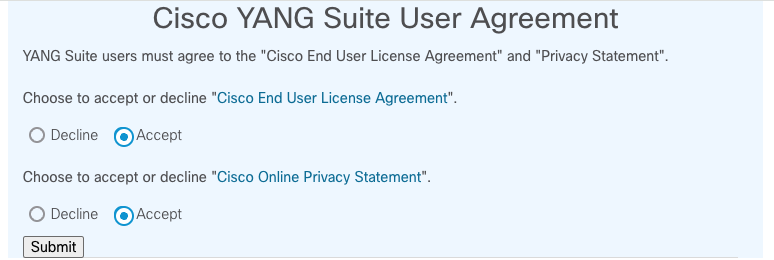
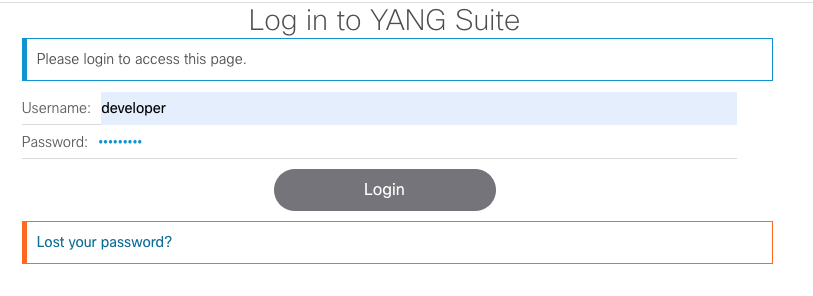

Copyright 2025 Cisco Systems, Inc

Cisco YANG Suite
==========

YANG Suite core Django application.

Capable of dynamic discovery of installed application plugins.
Provides common library APIs for logging, filesystem access,
GUI appearance and behavior, and client-server communication.

- Authors:  Members of the Cisco YANG Suite development team.
- Supports: Python 3.9+ with **recommended Python 3.10**
  
YANG Suite can be installed as a Docker container or through Python
package management. Docker-compose with the one-container-alternative is the recommended install.

YANG Suite requires about 3.5GB of memory to load large Cisco native models.

## YANG Suite Resources

DevNet YANG Suite landing page: [developer.cisco.com/yangsuite](https://developer.cisco.com/yangsuite)

Documentation: [developer.cisco.com/docs/yangsuite](https://developer.cisco.com/docs/yangsuite)

### YANG Suite Learning Lab
Hands-on [Learning Lab](https://developer.cisco.com/learning/labs/intro-yangsuite/introduction-launching-yang-suite/)


Explore the following features in YANG Suite:
- Access to YANG Suite
- Tutorials on getting started
    - Connect a device to YANG Suite
    - Download YANG models from device
- Explore YANG models
- NETCONF: GET/SET/SUBSCRIBE
    - Generate Ansible & Python
- RESTCONF: GET/SET/SUBSCRIBE
    - Generate Ansible & Python
- gNMI: GET/SET/Subscribe
    - Generate Ansible
- gRPC Telemetry receiver
- SNMP -> YANG mapping
- Datasets & Diffs

Learning Lab



Use these sandboxes to get started with YANG Suite
- c9kv
- c8kv
- combined sandbox

[YANG Suite TDM PDF](https://pubhub.devnetcloud.com/media/yang-suite/docs/YANGSuite%20TDM%20-%20Communities.pdf)
----------------------------
This PDF document has technical details of all capabilites of the YANG Suite tool, including installation, setup, and use of all plugins and features. It is a very detailed document that can be refered to for using the tool and examples for each plugin.


# YANG Suite One Container

| Feature         | Docker                          |
| -------------   | -------------                   |
| Prerequisites   | Install docker & docker compose | 
| Security        | HTTPS                           | 
| YS GUI Ports    | 8480                            | 
| Telemetry Ports | 57500 - 57501                   | 

## Prerequisites for Docker

To use the resources in this repository, you must install Docker on the system where you want to run YANG Suite. In addition, since this YANG Suite repository uses Docker Compose, your system needs Docker Compose. Docker Desktop for Mac & Windows installations include Compose and you can install those using instructions at https://docs.docker.com/install. For Linux, follow [these specific instructions to install Docker Compose on Linux systems](https://docs.docker.com/compose/install/#install-compose-on-linux-systems).

# one-container-alternative

A single-container alternative to YANG Suite's previous multi-container setup.

Note: for Linux, Ubuntu 24.04+ is recommended.

## Quick Start

> [!IMPORTANT]
> All commands must be run from the `one-container-alternative` directory, **not** the repository root.

```bash
# Navigate to the one-container-alternative directory
cd one-container-alternative

# Build and run YANG Suite
make build
make run
```

Make Build example on Linux:
```
auto@pod7-xelab:~/yangsuite-main/one-container-alternative$ make build
Using container runtime: docker
docker build --target app_setup --platform linux/$(uname -m | sed 's/arm64/arm64/g' | sed 's/x86_64/amd64/g') -t yangsuite-one-container .
DEPRECATED: The legacy builder is deprecated and will be removed in a future release.
            Install the buildx component to build images with BuildKit:
            https://docs.docker.com/go/buildx/

Sending build context to Docker daemon  25.09kB
Step 1/23 : ARG PY_VERSION=3.10
Step 2/23 : FROM python:${PY_VERSION} as base
3.10: Pulling from library/python
80b7316254b3: Pull complete
36e4db86de6e: Pull complete
8ea45766c644: Pull complete
3cb1455cf185: Pull complete
013acb959c95: Pull complete
ee334269ae4f: Pull complete
3eca4263ed42: Pull complete
Digest: sha256:4585309097d523698d382a2de388340896e021319b327e2d9c028f3b4c316138
Status: Downloaded newer image for python:3.10
 ---> d565b0a5e178
Step 3/23 : ARG DEBIAN_FRONTEND=noninteractive
 ---> Running in 58bc7a945aa9
 ---> Removed intermediate container 58bc7a945aa9
 ---> 6bacac563a54
<snip>
...
```

Make Run example:
```
auto@pod7-xelab:~/yangsuite-main/one-container-alternative$ make run
Using container runtime: docker
docker run -itd --name yangsuite-one-container -v ./certificate:/certificate -v yangsuite-one-container-data:/ys-data --memory 4096m --memory-swap 4096m -p 8480:8480 -p 57500:57500 -p 57501:57501 -u root yangsuite-one-container
ecd184e15e62105ab8664eec4bdc9aca217b46fa06cfbd5063923f847f476f6c
auto@pod7-xelab:~/yangsuite-main/one-container-alternative$ docker ps
CONTAINER ID   IMAGE                           COMMAND                  CREATED          STATUS          PORTS                                                                                                              NAMES
ecd184e15e62   yangsuite-one-container         "/build-assets/start…"   43 seconds ago   Up 42 seconds   0.0.0.0:8480->8480/tcp, :::8480->8480/tcp, 0.0.0.0:57500-57501->57500-57501/tcp, :::57500-57501->57500-57501/tcp   yangsuite-one-container
```

Next visit <https://localhost:8480> 

Accept the User Agreement


Login with:

- **Username:** `developer`
- **Password:** `developer`



## Overview

This alternative installation uses only a single container instead of three, making it simpler to use.

### Advantages

- Fewer points of failure - one container for all requirements.
- No user input required - configuration settings are preset.
- No Docker/Podman Compose needed - only Docker/Podman commands.
- HTTPs only on port `8480`

### Limitations

- No backup cron job.
- Container runs as root (`/usr/local/bin/create_yangtree` had permissions issues).

## Prerequisites

- `Docker` or `Podman` (container runtime).
- `Make` (build automation tool).
- 4GB+ available RAM (recommended).

This command creates and starts the container, exposing YANG Suite on port 8480 (HTTPS only) with a persistent volume for your data.

## Managing the Container

You can control the container lifecycle with these commands:

```bash
make stop    # Stop the running container
make start   # Start the stopped container
make rm      # Remove the container (data persists in volume)
```

## Using Custom Certificates

By default, the container uses self-signed certificates. To use your own SSL certificates:

1. Place **exactly one** `.crt` and **one** `.key` file in the `certificate` directory inside the `one-container-alternative` directory.
2. Run `make run` - your certificates will be automatically detected and used.

> [!NOTE]
> The container automatically detects custom certificates. If none are found, it falls back to self-signed certificates.

## Troubleshooting & Logs

### "make: command not found" or "No such file or directory"

You're probably in the wrong directory. Make sure you're in `one-container-alternative`:

```bash
# Check your current directory
pwd

# If you're in the repository root, navigate to the subdirectory:
cd one-container-alternative

# Verify you can see the Makefile:
ls Makefile
```

#### Expected directory structure

```text
yangsuite/                          # Repository root
├── README.md                       # Main YANG Suite README
├── docker/                         # Main Docker setup
└── one-container-alternative/      # ← You should be here
    ├── Dockerfile
    ├── Makefile                    # ← This should exist
    ├── README.md                   # ← This file
    └── build-assets/
```

### Viewing Logs

Watch real-time application logs:

```bash
make follow    # View container logs (Ctrl+C to stop)
```

Access internal YANG Suite logs:

```bash
make debug     # Monitor internal application logs
```

Get shell access for debugging:

```bash
make cli       # Open bash shell inside container
```

## Data Persistence

Your YANG Suite data is stored in the Docker volume `yangsuite-one-container-data`. This means:

- Settings and configurations persist between container restarts.
- Data survives container removal (unless you run `make rm-volume`).
- You can backup/restore data by managing this volume.

## Quick Development Workflow

For development and testing, use this command to rebuild and restart everything:

```bash
make dev       # Removes container+volume, rebuilds, runs, and follows logs
```

> [!WARNING] > `make dev` removes all data! Only use for development.


### TODO:
- add mac
- add windows (find/create a VM / add to CML)
- ask for support from community guide contact


## Using YANG Suite Once Installed
Once installation is complete, see the following guide on how to use each plugin
Follow the steps outlined in the [Learning Lab](https://developer.cisco.com/learning/labs/intro-yangsuite/introduction-launching-yang-suite/) starting at Step 2 to configure your device within YANG Suite and follow any of the relevant Learning Lab chapters for your needs


If needed, revert back to the [three-container legacy YANG Suite](three-container/README-three-containers.md)