# Lab Overview

This lab has multiple sections:

1. NETCONF with BGP EVPN oper
1. NETCONF GET Gig Inteface config
1. NETCONF Update interface into shut state
1. NETCONF GET Loopback interface
1. NETCONF Update interface description
1. NETCONF Delete interface decription

### Note: This portion of the lab is designed for working in dCloud (not in the programmabilty pods) 
## NETCONF: GET BGP EVPN
1. Connect to dCloud if you aren't already. See facilitators for a previously reserved session. 
    1. You can reach this environment using RDP or navigating to through the brower 
    1. After the session, you can reserve your own session [here](https://dcloud2-sjc.cisco.com/content/catalogue?search=Cisco%20Catalyst%209000%20IOS%20XE%20Programmability%20%26%20Automation%20Lab&screenCommand=openSearchScreen). Note that you may need to change the region to match your local region.

1. Once your dCloud environment has booted up, navigate to Chrome and the tab "localhost:8480"
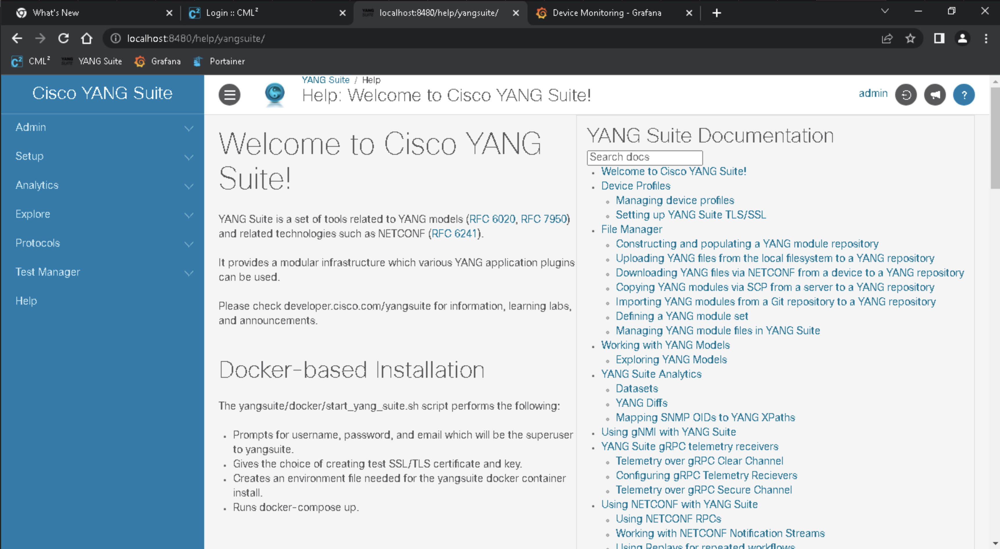

1. On the left blue navigation bar, select "Protocols" > "NETCONF" 
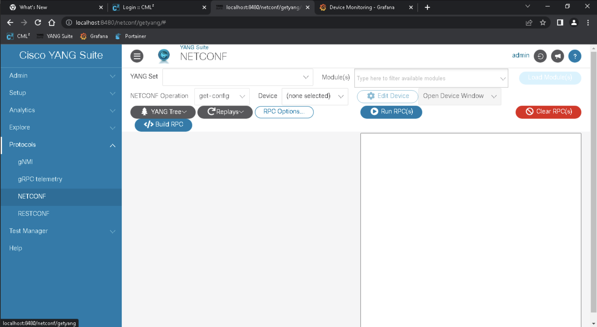

1. YANG Set: “198-18-1-21-default-yangset”
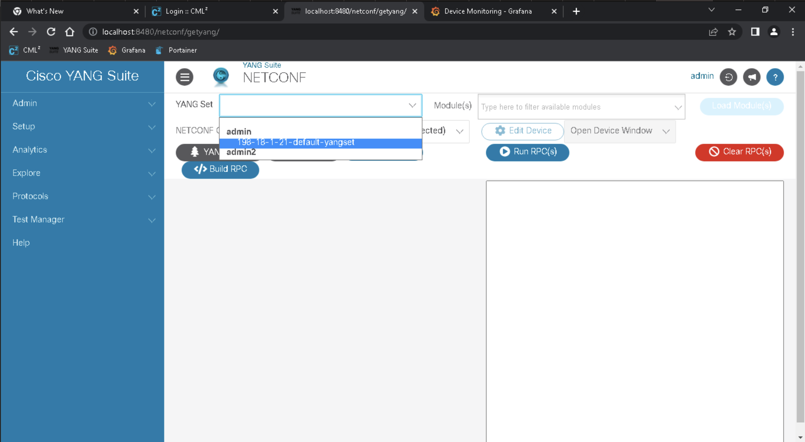

1. Modules: "Cisco-IOS-XE-bgp-oper" (note: start typing "bgp" to filter through the options in the dropdown menu)
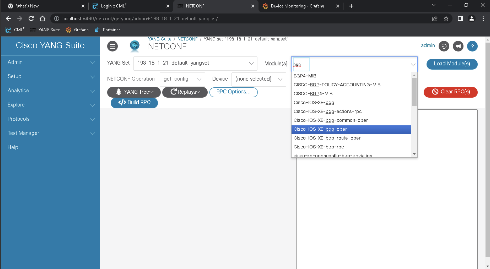

1. Click the blue “Load Modules” button

1. NETCONF Operation: “get”
1. Device: "198.18.1.21"
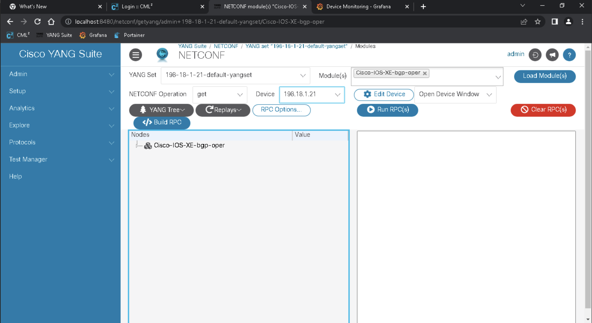

1. Wait for the tree to appear in the grey box on the left. (note: if you get an Error 500 popup, just ignore it and close the popup.)
1. Select the checkbox next to "bgp-state-data"
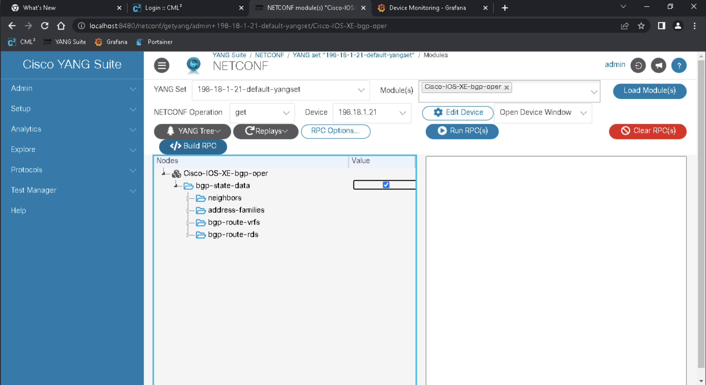

1. If there is previous RPC in the RPC window, select "Clear RPC"
1. Select “Build RPC”
1. Select “Run RPC”
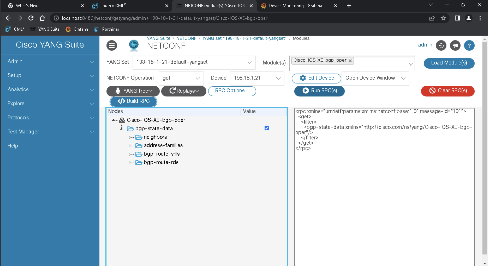

1. Validate that data is coming in from the device in a new window
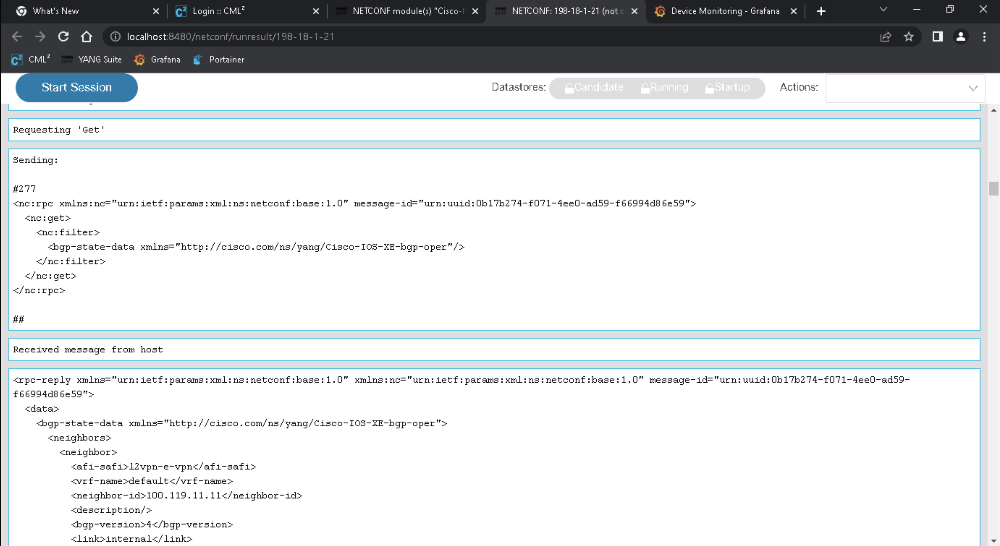

For a full view, see the example below:
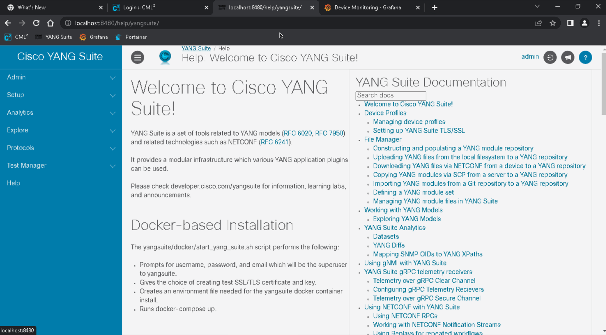

### Note: This portion of the lab is designed for working in the programmabilty pods (not the dCloud environment)
## NETCONF: GET Interface Descriptions 
Using NETCONF, make an API call to the C9300 device to determine the description of an interface.

1. Navigate to http://localhost:18480 in the browser. Note: Safari will not work because it uses HTTPS (rather than HTTP) by default.

1. Select the following in YANG Suite

    1. Protocol: “NETCONF”
    1. YANG Set: “c9300-default-yangset”
    1. Modules: “Cisco-IOS-XE-native” (note: start typing "native" to filter through the options in the dropdown menu)
    1. Click the blue “Load Modules” button
    1. NETCONF Operation: “get-config”
    1. Device: “c9300”
    1. Wait for the tree to appear in the grey box on the left. (note: if you get an Error 500 popup, just ignore it and close the popup.)
    1. Once the YANG tree is created, select "interface" (note: select CONTROL + F to find "interface" on the page)
    1. From within the "interface" dropdown, select "GigabitEthernet" (note: select CONTROL + F to find "GigabitEthernet" on the page)
    1. In the ***"name"*** section under "GigabitEthernet", add ***“1/0/1”***

The screen should look similar to below:

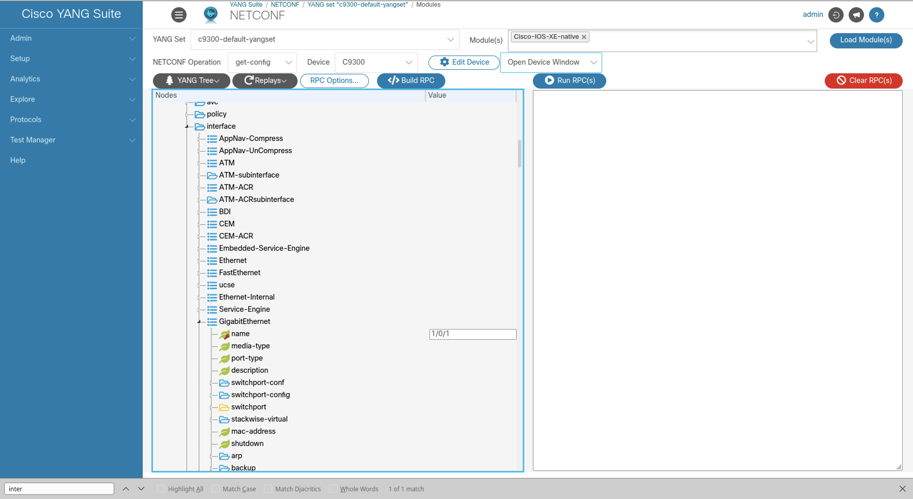

1. Click the blue "Build RPC" button to ***generate*** the XML RPC that is based on the YANG model and inputs provided. The XML can be reviewed, edited, or used in other tooling or orchestration systems as needed

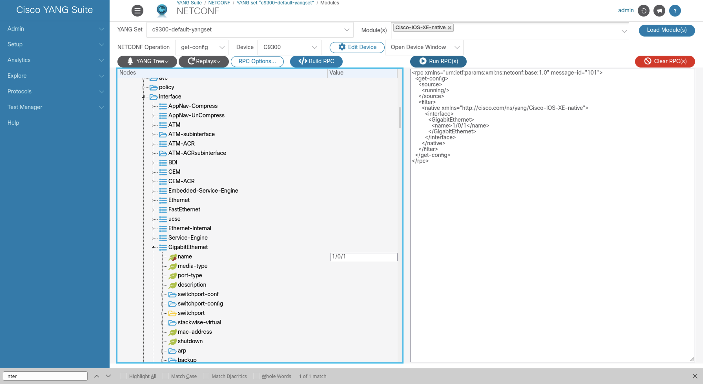

1. Click the blue "Run RPC(s)" button to ***send*** the XML RPC to the switch's NETCONF Interface in order to retreive the config as requested

1. In the new tab that's opened, notice the description of GigabitEthernet1/0/1 has changed. (note: you may need to scroll up)

## NETCONF: UPDATE interface (shutdown)
Make an API call that edits the interface to “shutdown”. (note: If you've completed the NETCONF GET task above, you can skip to step 1.5 below)

1. Select the following in YANG Suite:
    1. Protocol: “NETCONF”
    1. YANG Set: “c9300-default-yangset”
    1. Modules: “Cisco-IOS-XE-native”
    1. Click “Load Modules” (*** NOTE: Please be patient! For about 2 mins)
    1. NETCONF Operation: “edit-config”
    1. Device: “c9300”
    1. Once the YANG tree is created, select "interface" (note: select CONTROL + F to find "interface" on the page)
    1. From within the "interface" dropdown, select "GigabitEthernet" (note: select CONTROL + F to find "GigabitEthernet" on the page)
    1. In the name section under "GigabitEthernet", add “1/0/2”
    1. Select the checkbox next to “shutdown”
    1. If there is previous RPC in the RPC window, select "Clear RPC"
    1. Select “Build RPC”
    1. Select “Run RPC”
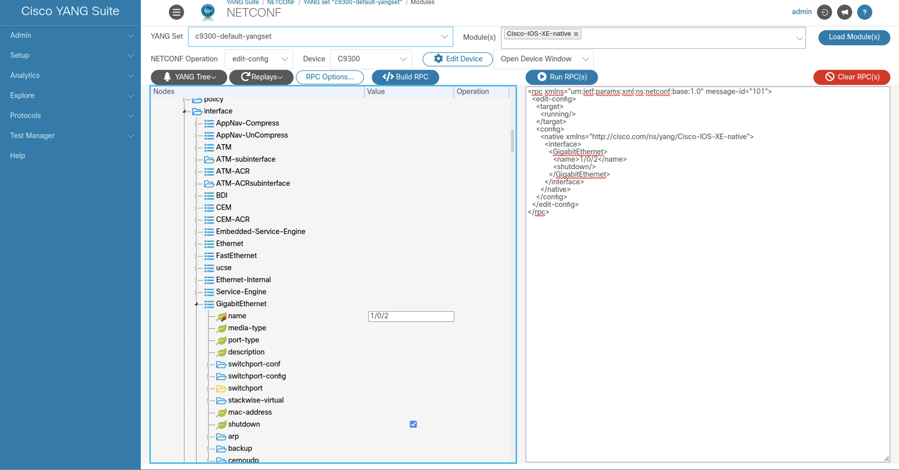

## NETCONF: GET Loopback0
Make an API call to get the Loopback0.

1. Protocol: "NETCONF"
1. YANG Set: "c9300-default-yangset"
1. Modules: "Cisco-IOS-XE-native"
1. Click the blue "Load Modules" button
1. NETCONF Operation: "get-config"
1. Device: "c9300"
1. Clear all of the currently selected values in the tree by selecting the "YANG tree" button and from the dropdown, select "Clear Values and Operations"

1. Once the YANG tree is created, select "interface" (note: select CONTROL + F to find "interface" on the page)
1. From within the "interface" dropdown, select "Loopback" (note: select CONTROL + F to find "Loopback" on the page)
1. In the name section under "Loopback", add “0”
1. Click the red "Clear RPC(s)" button
1. Click the blue "Build RPC" button
1. Click the blue "Run RPC(s)" button
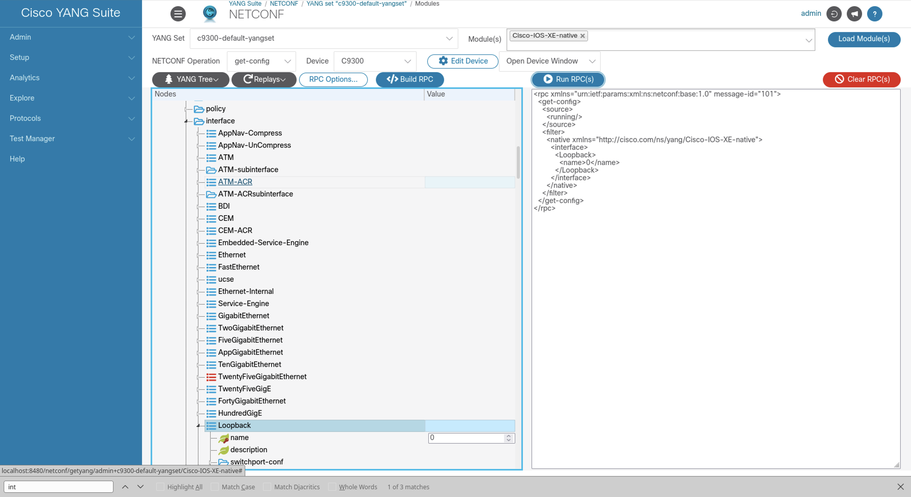

## NETCONF: Update Interface Description
Make an API call that edits the Loopback0 interface description.

1. Protocol: “NETCONF”
1. YANG Set: “c9300-default-yangset”
1. Modules: “Cisco-IOS-XE-native”
1. Click “Load Modules”
1. NETCONF Operation: “edit-config”
1. Device: “c9300”
1. Once the YANG tree is created, select "interface" (note: select CONTROL + F to find "interface" on the page)
1. From within the "interface" dropdown, select "Loopback" (note: select CONTROL + F to find "Loopback" on the page)
1. In the name section under "Loopback", add “1”
1. Select “description” and add a string of text such as “Configured by YANG Suite”
1. Select “Clear RPC” to remove any previous RPC
1. Select “Build RPC”
1. Select “Run RPC”

## NETCONF: DELETE Interface Description
Make an API call to delete the interface description.

1. Protocol: "NETCONF"
1. YANG Set: "c9300-default-yangset"
1. Modules: "Cisco-IOS-XE-native"
1. Click "Load Modules"
1. NETCONF Operation: "edit-config"
1. Device: "c9300"
1. Once the YANG tree is created, select "interface" (note: select CONTROL + F to find "interface" on the page)
1. From within the "interface" dropdown, select "Loopback" (note: select CONTROL + F to find "Loopback" on the page)
1. In the name section under "Loopback", add "1" 
1. Select "description" and click on the right of the textbox wth the description string to expand the dropdown menu. Select "delete" from the dropdown.
4. Select “Clear RPC” to remove any previous RPC
5. Select “Build RPC”
6. Select “Run RPC”
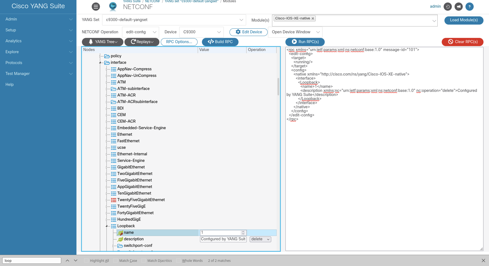