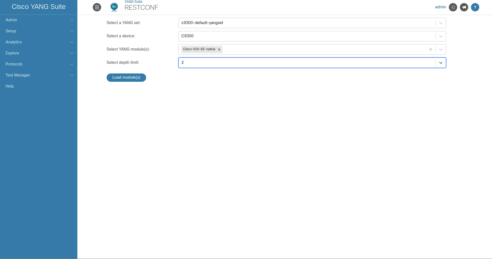
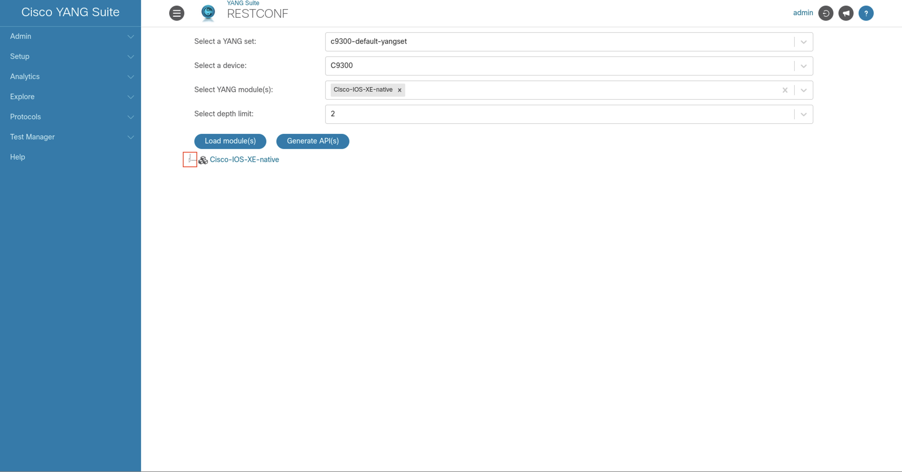
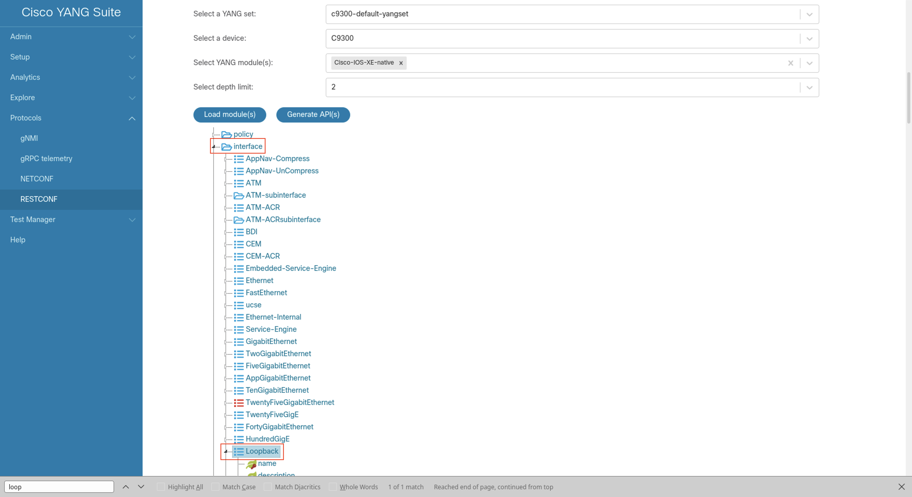
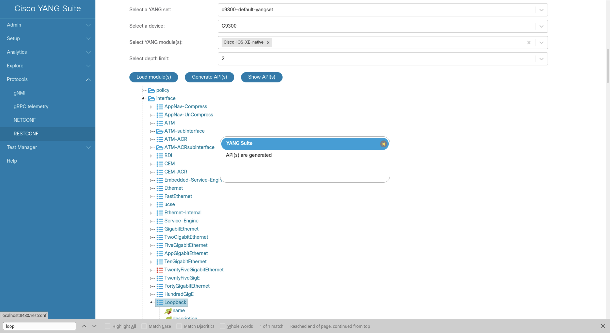
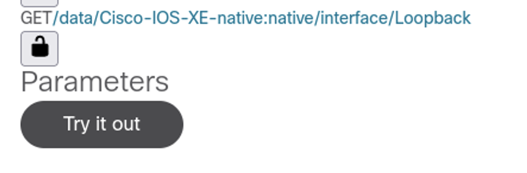
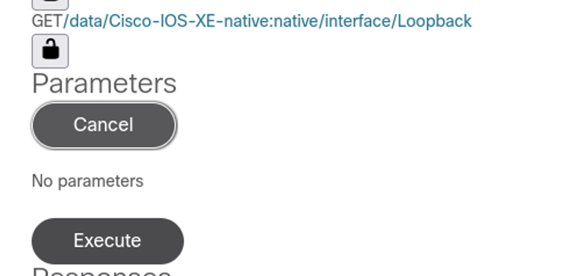

# Lab Overview

This lab has multiple sections:

1. RESTCONF GET Loopback

## RESTCONF: GET Loopback Mask
Make an API call to get the interface description.

1. Protocol: “RESTCONF”
1. Select a YANG Set: “c9300-default-yangset”
1. Select a device: “C9300”
1. Select YANG modules: “Cisco-IOS-XE-native”
1. Select depth limit: “2”
1. Select "Load Module(s)"

1. Once the tree loads, close the popup that says "Tree generated, please select node(s) to generate API(s)"
1. Expand the tree by selecting the arrow next to “Cisco-IOS-XE-native”

1. Search for “interface” in the expanded tree. (note: select CONTROL + F to find "interface" on the page)
1. Expand “interface” and search for “Loopback" (note: select CONTROL + F to find "Loopback" on the page)

1. Click the blue “Generate API(s)” button. (note: it may take a few moments to load the APIs)
1. Close the popup that says “API(s) are generated”

1. Click the blue “Show API(s)” button
1. Select the link next to the "GET" operation corresponding to the API call "/data/Cisco-IOS-XE-native:native/interface/Loopback"
1. Click the "Try it out" button

1. Click the "Execute" button to send the RESTCONF payload and view the reply, including the Loopback Netmask

