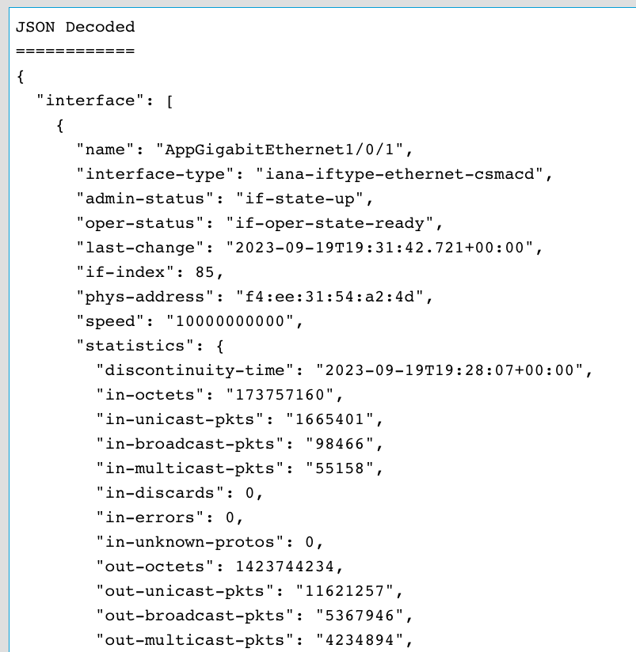

# Build and send gNMI messages

Next, we will explore how to use YANG Suite to build, send, and receive gNMI messages. If you completed the **Exploring IOS XE YANG Data Models with NETCONF** Learning Lab, the messages you send and receive should look very familiar. However, in this Lab, we are using the YANG Suite GUI, no Python scripting knowledge required.

From the YANG Suite menu, select **Protocols > gNMI**.


# gNMI Capabilities

The capabilties exchange is accessed from the gNMI plugin of YANG Suite once the device has been selected then the **Capabilities** button will send the RPC that returns the list of data modules, the version or date, and a brief description.


## Using a gNMI `get-config` RPC to inspect device configuration

The gNMI GET in this example is against the **Cisco-IOS-XE-interfaces-oper.YANG** module where the top level **interfaces** container has been selected. All data from the **interface** list will be collected for each of the keyed values. The keyed values for this module is the **"name"** which is the Interface Name, typically Gigabit0/0, GigabitEthernet6/0/4, etc.

The GET payload in this example has several options specified for the **Cisco Native** data model: The origin is **RFC 7951** and the Encoding Type is **JSON_IETF**. **PROTO** encoding is also supported.


The gNMI RPC used in this example is:

```
{
  "path": [
    {
      "origin": "rfc7951",
      "elem": [
        {
          "name": "Cisco-IOS-XE-interfaces-oper:interfaces"
        }
      ]
    }
  ],
  "encoding": "JSON_IETF"
}

```

Once the **Run RPC** button is selected then the payload is sent to the gNMI API which processes and it repsonds back with the data in the **json_ietf_val** field


The **json_ietf_val** is further decoded by YANG Suite so it's easier to understand the JSON blobs that are received:



Here is just the statistics and some additional leafs from the **TenGigE1/0/10** interface

```      
"name": "TenGigabitEthernet1/0/10",
      "interface-type": "iana-iftype-ethernet-csmacd",
      "admin-status": "if-state-up",
      "oper-status": "if-oper-state-ready",
      "last-change": "2023-09-19T19:31:10.809+00:00",
      "if-index": 18,
      "phys-address": "f4:ee:31:54:a2:0a",
      "speed": "1000000000",
      "statistics": {
        "discontinuity-time": "2023-09-19T19:28:07+00:00",
        "in-octets": "1414387926",
        "in-unicast-pkts": "4536232",
        "in-broadcast-pkts": "81061",
        "in-multicast-pkts": "81044",
        "in-discards": 0,
        "in-errors": 0,
        "in-unknown-protos": 0,
        "out-octets": 2303595023,
        "out-unicast-pkts": "13028767",
        "out-broadcast-pkts": "5368080",
        "out-multicast-pkts": "4229537",
        "out-discards": "0",
        "out-errors": "0",
        "rx-pps": "1",
        "rx-kbps": "1",
        "tx-pps": "5",
        "tx-kbps": "5",
        "num-flaps": "0",
        "in-crc-errors": "0",
        "in-discards-64": "0",
        "in-errors-64": "0",
        "in-unknown-protos-64": "0",
        "out-octets-64": "2303595023"
```

This is an example of a GET for opererational data like the interface statitics and counters.

The next example is a GET of the configuration the will be modified in the next example.

In this example the **Cisco-IOS-XE-native.YANG** module is used which represents the majority of the **running-config** from Cisco IOS XE. The **hostname** leaf will be used in this example.

The following RPC is generated and sent to retreive the device hostname:

```
{
  "path": [
    {
      "origin": "rfc7951",
      "elem": [
        {
          "name": "Cisco-IOS-XE-native:native"
        },
        {
          "name": "hostname"
        }
      ]
    }
  ],
  "encoding": "JSON_IETF"
}
```
Once this payload is send and received by YANG Suite, the results show the hostname: **jcohoe-c9300x** - In the next step the SET operation will be used to change this configuration


## Using a gNMI `edit-config` RPC to modify device configuration

The gNMI **SET** operation is used to SetUpdate, SetReplace, or SetDelete the configuraiton. Since no additional SET operation is defined the default per specification **Update** is used.


The payload sent in this example to update the hostname is:

```
{
  "update": [
    {
      "path": {
        "origin": "rfc7951",
        "elem": [
          {
            "name": "Cisco-IOS-XE-native:native"
          },
          {
            "name": "hostname"
          }
        ]
      },
      "val": {
        "jsonIetfVal": "\"set-by-gnmi\""
      }
    }
  ]
}
```

The response from the API is below showing that the API call was successfull


Performing another GET operation will confirm the newly updated hostname configuration


This example shows how to use the **Cisco Native** data model to upate the running configuration of the device. While the use case is for **hostname** any other feature or configuration can easily be managed in this way


## Using a gNMI subscribe RPC to receive Model Driven Telemetry (MDT) data

The gNMI API also supports the **subscribe** operation for Model Driven Telemetry with the same set of YANG modules as seen in the capabilities exchange. 

For a deeper dive into Model Driven Telemetry refer to the [Github.com/jeremycohoe/cisco-ios-xe-mdt](https://github.com/jeremycohoe/cisco-ios-xe-mdt) github repository

In this example the **Cisco-IOS-XE-poe-oper** YANG data model will be used. This YANG module includes per-port Power-over-Ethernet statistics including how much power energy in watts is available and consumed.

The **Subscribe** payload is below which shows the settings needed to successfully create the Model Driven Telemetry subscription over gNMI. In this example the **Stream** mode is selected with a **Sample** interval set to 30 seconds and the **RFC7951** encoding is used since this is a Cisco Native module. Path Prefixing is not enabled


The **Subscribe** payload that is generated looks similar to below

```
{
  "subscribe": {
    "subscription": [
      {
        "path": {
          "origin": "rfc7951",
          "elem": [
            {
              "name": "Cisco-IOS-XE-poe-oper:poe-oper-data"
            },
            {
              "name": "poe-port-detail"
            }
          ]
        },
        "mode": "SAMPLE",
        "sampleInterval": "30000000000"
      }
    ],
    "encoding": "JSON_IETF"
  }
}
```

Once this payload is sent from YANG Suite to the gNMI API the response is seen. It shows that port TenGig1/0/37 is showing a value of **41.89 watts of power-used**


After the sample interval of 30 seconds occurs then another payload is received from the gNMI API to YANG Suite which contains updated statistics and counters


Subscribing to Model Driven Telemetry in YANG Suite is a good start to validating that the data expected is received from the API. This is useful when building additional charts and graphs in other tooling systems. The recommended tooling is **Telegraf from InfluxDB** or the [Cisco Telemetry Broker](https://cs.co/telemetrybroker) available from Cisco Security

Additional details of the POE telemetry usecase is available from the [Github jeremycohoe cisco-mdt-poe](https://github.com/jeremycohoe/cisco-mdt-poe) Github repository where the data is collected into the time-series database and power use is vizualized over time in the Grafana tool

