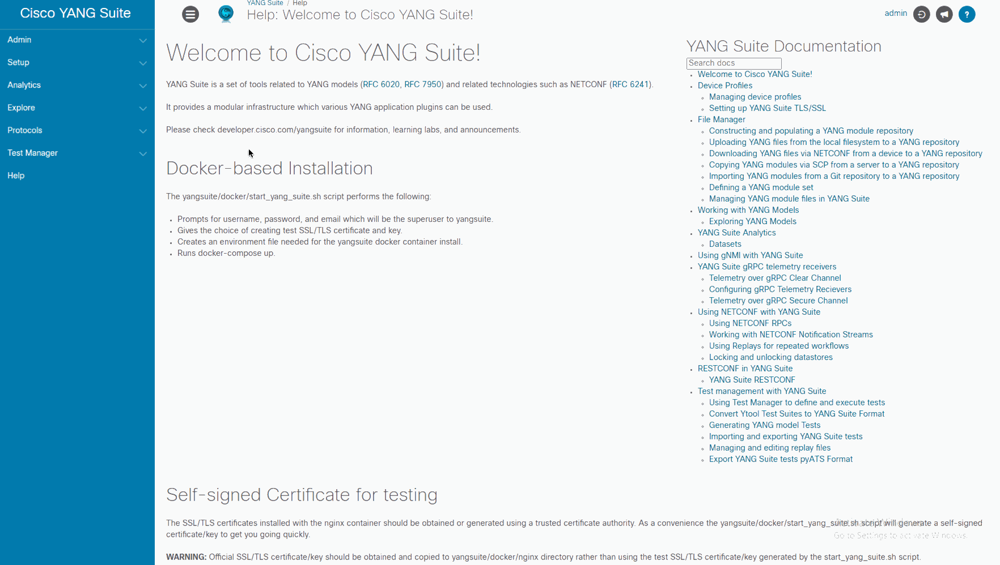
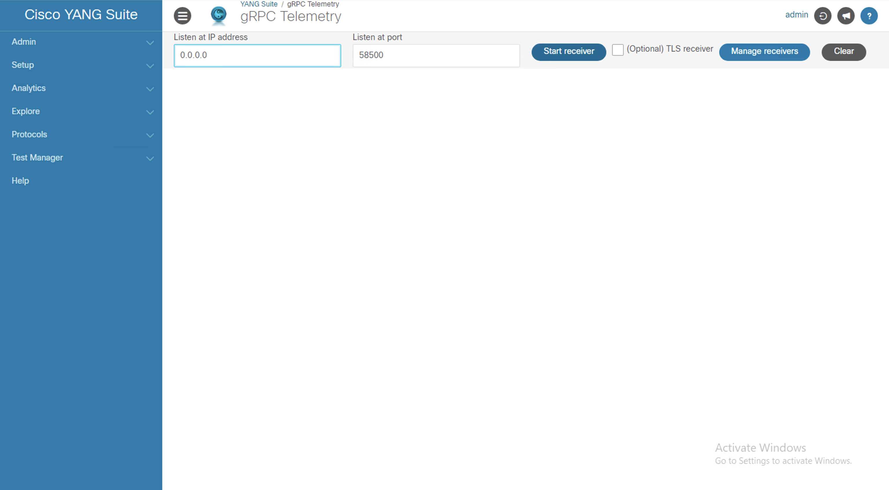
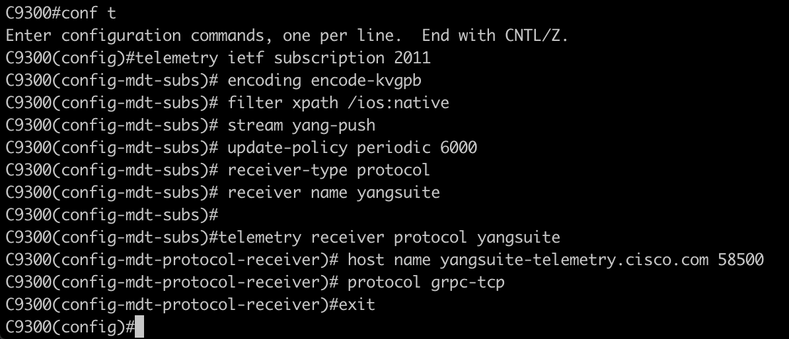
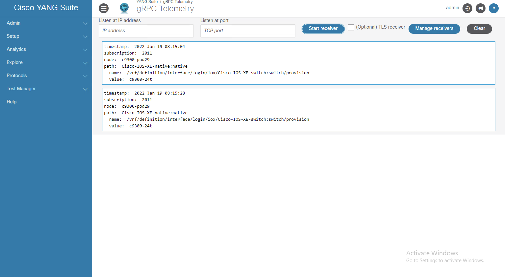

# Lab Overview

This lab has multiple sections:

1. gRPC Telemetry


## gRPC subscription


1. In YANG Suite,
    1. Protocol: "gRPC telemetry"
    1. Listen at IP address: “0.0.0.0”
    1. Listen at port: “58500”
    1. Click the “Start receiver” button
    
1. On the switch, configure the subscription by copy/pasting the configs:
    ```
    conf t
    telemetry ietf subscription 2011
    encoding encode-kvgpb
    filter xpath /ios:native
    stream yang-push
    update-policy periodic 6000
    receiver-type protocol
    receiver name yangsuite

    telemetry receiver protocol yangsuite
    host name yangsuite-telemetry.cisco.com 58500
    protocol grpc-tcp
    ```
    

1. Back in YANG Suite, check the telemetry data that should appear at regular intervals on the "gRPC telemetry" screen
1. When the telemetry data begins to flow from the C9300 into YANG Suite, several lines of data will be displayed. Included in this is the timestam, subscription ID, node, path, name, and value fields.
